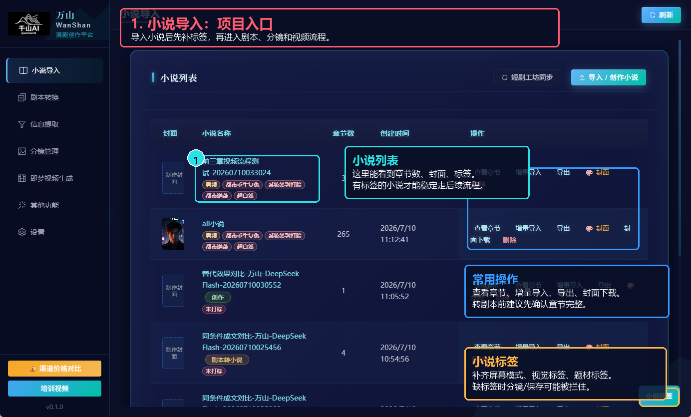
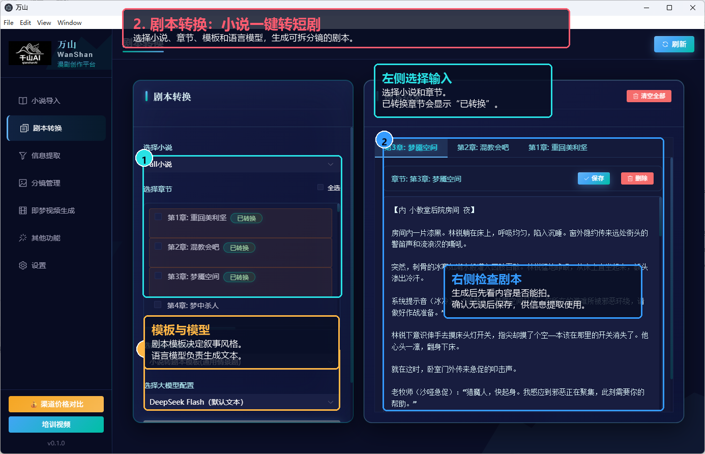
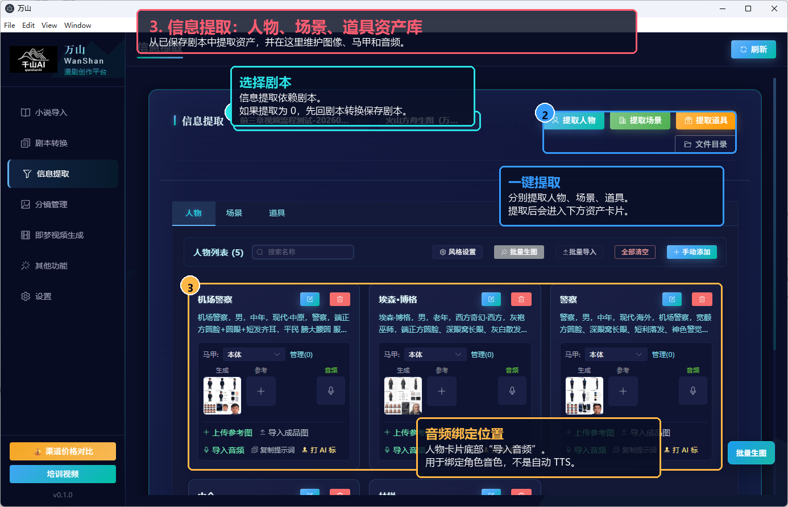
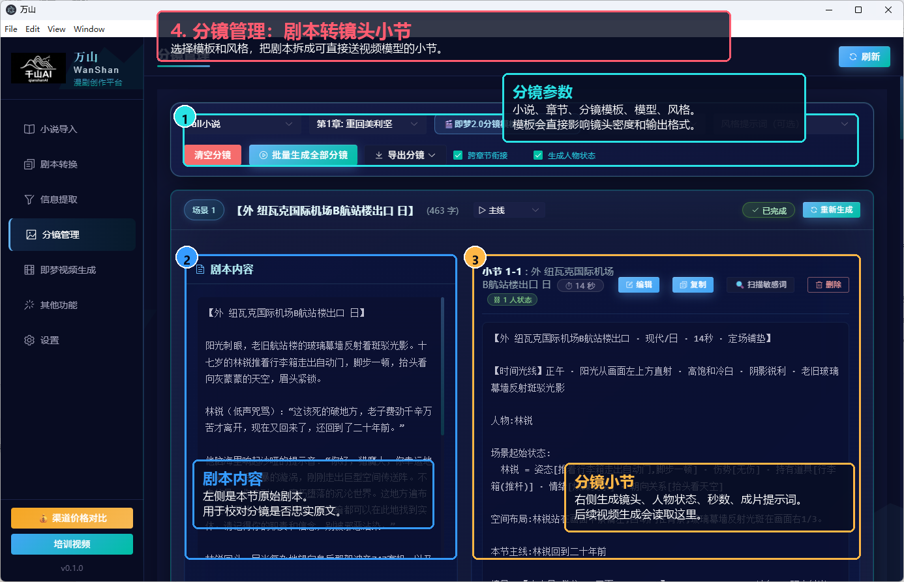
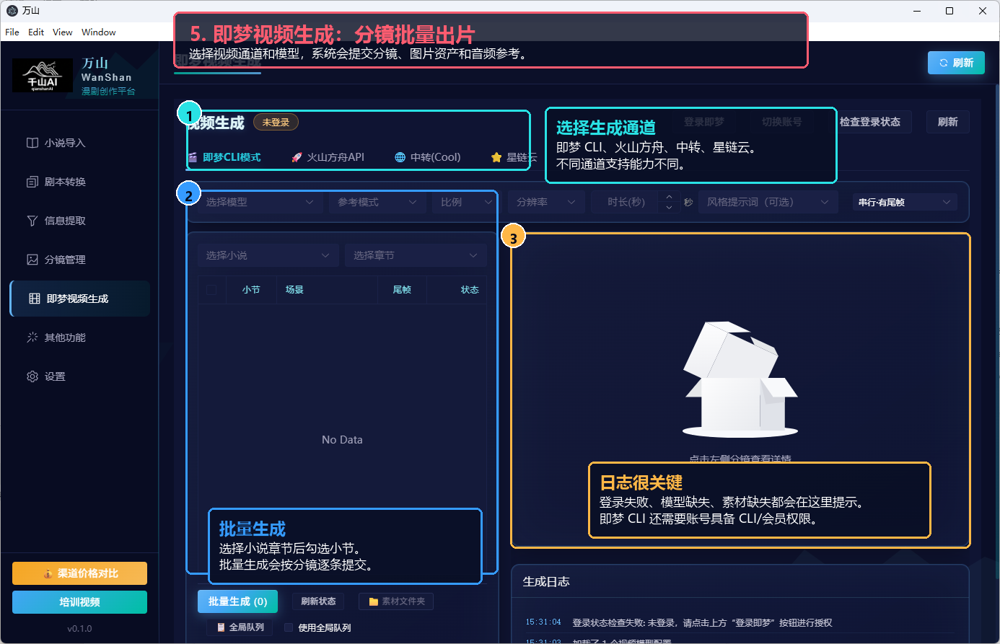
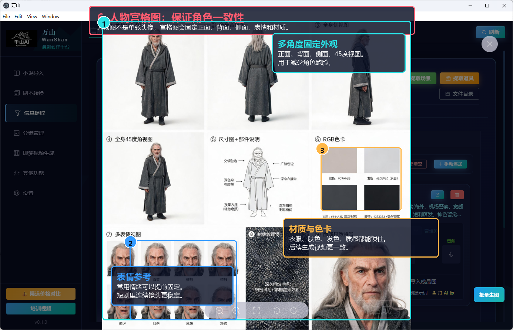

# 万山漫剧图文版教程

这份教程按真实业务数据截图制作，适合发给测试用户快速理解软件链路。

## 0. 总体链路

万山漫剧的核心流程是：

```text
导入小说
→ 小说打标签
→ 小说转剧本
→ 提取人物 / 场景 / 道具
→ 生成人物宫格图、场景图、道具图
→ 给人物导入音频作为音色参考
→ 生成分镜
→ 批量生成视频
```

音频部分要特别注意：当前稳定链路是“导入人物音频样本作为音色参考”，不是已经完整接好的“输入台词自动 TTS 配音”。

## 1. 小说导入：项目入口

先把小说导入软件，检查章节数、封面和标签。标签会影响后续分镜模板和视频风格选择。



操作要点：

- 有标签的小说更适合进入后续流程。
- 如果提示缺少屏幕模式或视觉标签，需要点击右下角“小说标签”补齐。
- 常用操作包括查看章节、增量导入、导出、封面下载。

## 2. 剧本转换：小说一键转短剧

进入“剧本转换”，选择小说、章节、剧本模板和语言模型，把小说章节转成可拍摄、可拆分镜的剧本。



操作要点：

- 左侧选择小说和章节。
- 已经转过的章节会显示“已转换”。
- 选择剧本模板和语言模型后点击转换。
- 右侧生成结果需要检查，确认可用后保存。

## 3. 信息提取：维护人物、场景、道具资产

进入“信息提取”，从已保存剧本里提取人物、场景和道具。这里是视频一致性的关键页面。



操作要点：

- 先选择小说和剧本。
- 点击“提取人物”“提取场景”“提取道具”。
- 如果提取结果是 0 个，通常说明剧本没有生成或没有保存。
- 人物卡片里可以上传参考图、导入成品图、生成宫格图、导入音频。

## 4. 分镜管理：剧本转镜头小节

进入“分镜管理”，选择小说、章节、分镜模板、语言模型和风格提示词，把剧本拆成一个个视频小节。



操作要点：

- 分镜模板决定镜头密度、格式和风格。
- 左侧是原始剧本，用来检查分镜是否忠实原文。
- 右侧是生成后的分镜小节，包括人物状态、镜号、秒数、成片提示词。
- 后续视频生成会读取这里的分镜内容。

## 5. 即梦视频生成：分镜批量出片

进入“即梦视频生成”，选择视频通道、模型、小说章节和分镜小节，批量生成视频。



操作要点：

- 可选通道包括即梦 CLI、火山方舟 API、中转、星链云。
- 不同通道支持的图片、音频、时长、比例能力不完全一样。
- 生成日志很重要，登录失败、模型缺失、素材缺失都会在这里提示。
- 即梦 CLI 不只需要网页登录，还需要账号具备对应 CLI/会员权限。

## 6. 人物宫格图：保证角色一致性

人物宫格图用于固定角色外观，不只是普通头像。它会尽量固定正面、背面、侧面、表情、服装、材质和色卡。



操作要点：

- 主要人物建议先生成宫格图，再批量跑视频。
- 宫格图能降低人物跑脸、服装漂移和表情不一致。
- 如果已有稳定角色图，也可以直接导入成品图。

## 7. 音频怎么导入

当前音频入口在：

```text
信息提取
→ 人物
→ 人物卡片
→ 导入音频 / 麦克风按钮
```

支持格式：

- mp3
- wav
- m4a
- ogg
- flac

建议标准：

- 2 到 15 秒。
- 单人干净人声。
- 不要背景音乐。
- 不要多人同时说话。
- 不要太长的对白。

导入后，音频会绑定到当前人物或人物马甲。视频生成时，如果当前视频通道支持音频参考，系统会把人物音频作为角色音色参考一起传给视频模型。

## 8. 音频怎么生成

当前版本的稳定生产方式是：

```text
外部录音 / 外部 TTS 生成短音频
→ 导入到万山人物卡片
→ 绑定角色音色
→ 视频生成时作为 reference_audio 使用
```

也就是说，软件现在主要负责“音频管理和引用”，不是完整自动配音系统。

后续可以继续增强：

- 根据剧本台词自动 TTS。
- 按角色批量生成台词音频。
- 台词级音频绑定。
- 导入后试听、裁剪、降噪。

## 9. 新用户最快上手流程

1. 设置里配置语言、图片、视频模型。
2. 导入小说。
3. 给小说补标签。
4. 到“剧本转换”把章节转成剧本并保存。
5. 到“信息提取”提取人物、场景、道具。
6. 给主要人物生成宫格图。
7. 给需要说话的角色导入 2 到 15 秒音频。
8. 到“分镜管理”生成分镜。
9. 到“即梦视频生成”批量出视频。

## 10. 还缺的截图

为了让教程更完整，后续建议补三张真实截图：

- 设置页：语言、图片、视频模型配置示例。
- 导入音频弹窗：选择本地音频文件的界面。
- 成功生成视频后的结果页：展示最终视频、日志和素材文件夹。

